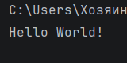

# Отчет 
### Задание 
1. Создать репозиторий для дисциплины на GitHub.
2. Клонировать его себе на ПК.
3. Написать свою первую программу.
4. Запустить ее.
5. Сделать коммит и пуш.
6. Написать отчет в README.md.

### Описание проделанной работы

На платформе GitHub я создала новый репозиторий. Написала программу `print ("Hello World!")`. Программа была успешно запущена, текст был выведен в консоль.

### Скриншот результата 

### Ссылки на использованные материалы

1. https://evil-teacher.orbiter.website/prog_pm/lab00/
2. https://doka.guide/tools/markdown/
3. https://github.com/still-coding/report_demo

