# Отчет
### Задание 0
Составить словарь словарей расстояний между городами.

### Описание проделанной работы
Вставила координаты из словаря в формулу: 
>Расстояние = ((x1 - x2) ** 2 + (y1 - y2) ** 2) ** 0.5

Для каждой пары городов результат округляю до двух знаков 
после запятой. После чего создаю словарь `distances`, где для каждого города 
указываю расстояния до двух других. Полученный словари вывожу в консоль.

### Скриншот результата 
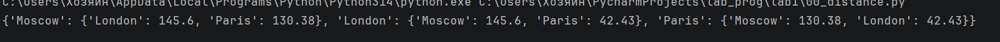

### Задание 1
1. Вывести на консоли значение площади этого круга с точностью до 4-х знаков после запятой.

2. Если точка point лежит внутри того самого круга, 
то вывести на консоль True, Или False, если точка лежит вовне круга. Аналогично для другой точки.

### Описание проделанной работы
Используя формулу площади круга:
>S=π⋅R²

, произвела расчет `plo = pi * (radius ** 2)`. С помощью функции
`round()` результат округлила до 4 знаков после запятой. Далее 
вычисляю расстояние от точки до начала координат по формуле:
>d=√x²+y²` 

Сравниваю `dis <= radius`. Повторяю то же самое для
второй точки.

### Скриншот результата 
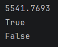

### Задание 2
Расставить знаки операций "плюс", "минус", "умножение" и скобки
между числами "1 2 3 4 5" так, что бы получилось число "25".

### Описание проделанной работы
Расставила знаки препинания, чтобы в результате получилось 25.
Ответ вывела на консоль.

### Скриншот результата
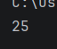

### Задание 3
Выведите на консоль с помощью индексации строки, последовательно:
первый фильм; последний; второй; второй с конца.

### Описание проделанной работы
Вручную определяю индекс начала и конца каждого названия. Вывожу
название первого фильма: `print(my_favorite_movies[0:10])`. Повторяю 
то же самое с другими фильмами. 

### Скриншот результата
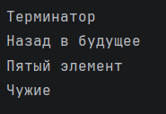

### Задание 4
Выведите на консоль рост отца и общий рост моей семьи.

### Описание проделанной работы
В списке перечисляю членов своей семьи. 
В следующем списке указываю их рост. 
Вывожу на консоль рост отца `print('Рост отца -', my_family_height[1][1],'см')`
Далее суммирую рост всех членов семьи и вывожу на консоль.

### Скриншот результата
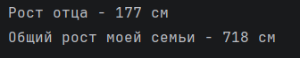

### Задание 5
1. Посадить медведя (bear) между львом и кенгуру и вывести список на консоль.
2. Добавить птиц из списка (birds) в последние клетки зоопарка и вывести список на консоль.
3. Убрать слона (elephant) и вывести список на консоль.
4. Вывести на консоль в какой клетке сидит лев (lion) и жаворонок (lark).

### Описание проделанной работы
Я добавила медведя между львом и кенгуру.
Для этого я использовала функцию `insert()` с индексом 1.
Далее я добавила птиц из списка birds в последние клетки.
Для этого использовала функцию `extend()`.
Я удалила слона из зоопарка с помощью функции `remove()`.
С помощью функции `index() + 1` вывела номера 
клеток, в которых сидят лев и жаворонок.

### Скриншот результата
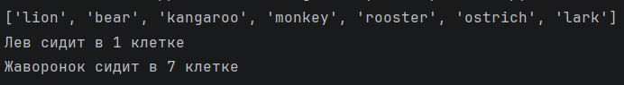

### Задание 6
1. Распечатать общее время звучания трех песен: 'Halo', 'Enjoy the Silence' и 'Clean'
2. Распечатать общее время звучания трех песен: 'Sweetest Perfection', 'Policy of Truth' и 'Blue Dress'

### Описание проделанной работы
С помощью цикла `for` выполнила перебор элементов списка.
Для каждой песни проверила совпадение названия `if song[0] == 'название песни':`,
при нахождении нужной песни я сохранила её длительность в отдельные переменные.
Далее сложила длительность трех песен и вывела ответ на консоль. То же самое повторила и 
для оставшихся трех песен.

### Скриншот результата
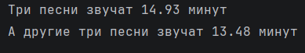

### Задание 7
Расшифровать сообщение и вывести его на консоль.

### Описание проделанной работы
С помощью ключа выяснила индекс первого слова и расшифровала `word1 = secret_message[0][3]`. 
Повторила все для оставшихся 4 слов, после чего объединила в одно сообщение.
### Скриншот результата
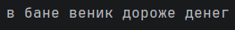

### Задание 8
1. Создать множество цветов, произрастающих в саду и на лугу и вывести на консоль.
2. Вывести на консоль те, которые растут и там и там.
3. Вывести на консоль те, которые растут в саду, но не растут на лугу.
4. Вывести на консоль те, которые растут на лугу, но не растут в саду.

### Описание проделанной работы
Сначала с помощью функции `set()` создаю множества для сада и луга. 
Далее я объединяю их и вывожу на консоль. 
Нахожу цветы, которые растут и там, и там `b = garden_set.intersection(meadow_set)`, после чего вывожу на консоль.
Вычисляю какие цветы растут только в саду, для этого использую метод `difference`. Вывожу на консоль. 
То же самое делаю для того, что бы найти цветы, которые растут только на лугу.
### Скриншот результата
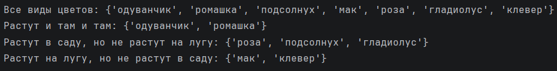

### Задание 9
Создать словарь цен на продукты.
### Описание проделанной работы
Сравниваю цены на печенье и указываю в списке два магазина с минимальными ценами. Повторяю с остальными сладостями.
### Скриншот результата
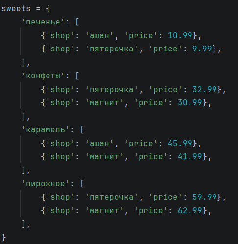

### Задание 10
Рассчитать на какую сумму лежит каждого товара на складе.
### Описание проделанной работы
Сначала получаю код товара из словаря `goods`, после чего в словаре списков `store` нахожу нужный товар.
Считаю общее количество и стоимость. Повторяю все для остальных товаров и вывожу результат на консоль.
### Скриншот результата
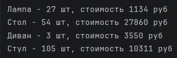

### Ссылки на использованные материалы
https://evil-teacher.orbiter.website/prog_pm/lab01/