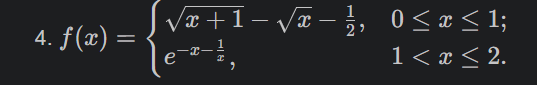
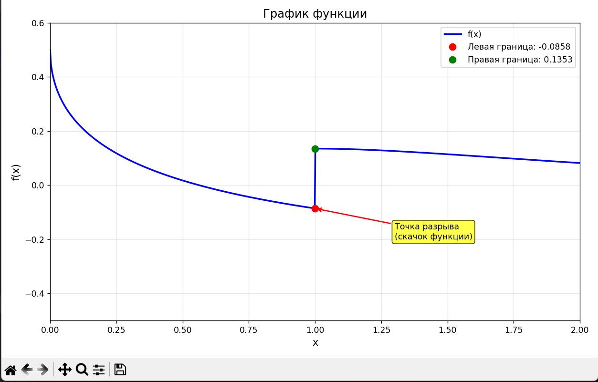

# Отчет
### Задание
1. Построить график функции.   
Добавить на график заголовок, подписи осей, легенду, сетку, а также аннотацию к точке касания.

2. Оформите отчёт в README.md.

### Описание проделанной работы
Я создала функцию `f(x)`, которая с помощью масок разделяет два интервала. 
Для `x ∈ [0, 1]` я применила выражение` √(x+1) - √x - 0.5`, а для `x ∈ (1, 2]` — `e^(-x - 1/x)`. 
С помощью `np.linspace(0, 2, 1000)` я создала 1000 точек и вычислила для них значения `y = f(x)`.
Я отобразила основной график синей линией, добавила подписи осей, заголовок, сетку и легенду.
В точке `x = 1` я вычислила левое и правое предельные значения. Левую границу я отметила красной 
точкой, правую — зеленой. С помощью `plt.annotate()` я добавила поясняющую подпись.
Я применила `plt.tight_layout()` и вывела график на экран.

### Скриншот результата

### Ссылки на использованные материалы
1. https://evil-teacher.orbiter.website/prog_pm/lab02/
2. https://matplotlib.org/
3. https://seaborn.pydata.org/
4. https://plotly.com/python/
