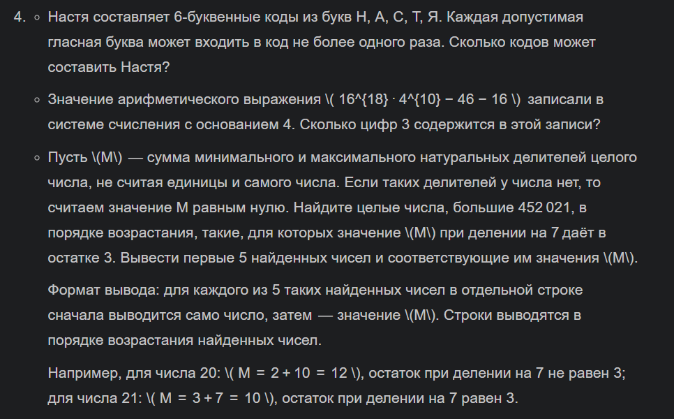
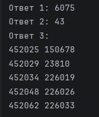

# Отчет
### Задание
1. Написать программу для решения задач своего варианта.

2. Оформите отчёт в README.md.

### Описание проделанной работы
Для первой задачи я импортировала функцию `product `
из модуля `itertools`, создала список букв ['Н', 'А', 'С', 'Т', 'Я'] и с 
помощью цикла `for` перебрала все 6-буквенные
 комбинации. Для каждой комбинации я проверила, 
что буквы 'А' и 'Я' встречаются не более одного раза,
и подсчитала количество подходящих вариантов.

Для второй задачи я вычислила значение выражения 16^18 * 4^10 - 46 - 16,
затем написала функцию перевода числа в четверичную систему счисления делением на 4.
Получив строковую запись числа, я подсчитала в ней количество цифр '3' методом `.count()`.

Для третьей задачи я написала функцию, 
которая находит минимальный и максимальный собственные делители числа и возвращает их сумму. 
Затем в цикле, начиная с числа 452022, я искала первые 5 чисел,
для которых эта сумма при делении на 7 дает остаток 3. 
Найденные пары я вывела на экран.
### Скриншот результата

### Ссылки на использованные материалы
https://evil-teacher.orbiter.website/prog_pm/lab03/