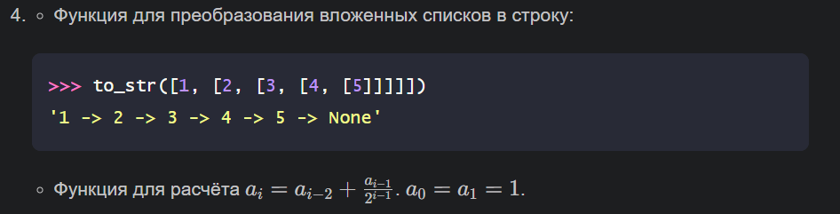
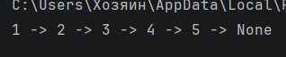
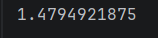

# Отчет 
### Задание
1. Написать две функции для решения задач своего варианта - с использованием рекурсии и без.

2.  Оформите отчёт в README.md.
### Описание проделанной работы
Для решения 1 задачи без рекурсии я создала пустой список `result` для хранения строковых представлений элементов и стек `stack`,
в который изначально положила исходный список `lst`. Запустила цикл `while stack` — он выполняется, пока стек не опустеет.
Внутри цикла я извлекла верхний элемент стека с помощью `pop()`. С помощью `isinstance(item, list)` я проверила, является 
ли этот элемент списком. После завершения цикла я добавила в `result` строку `'None'` и соединила все
элементы с помощью метода `join()`.

Для решения 1 задачи с рекурсией я добавила проверку с помощью `isinstance(lst, list)`, 
чтобы определить, является ли переданный аргумент списком. Если аргумент не является списком, 
я возвращаю его строковое представление через `str(lst)`. Если аргумент является списком,
я возвращаю форматированную строку:`f"{lst[0]} -> {to_str(lst[1] if len(lst) > 1 else None)}"`. 
Далее я беру первый элемент списка `(lst[0])`, а затем рекурсивно вызываю ту же самую функцию `to_str`
для остатка списка `(lst[1])`. Чтобы избежать ошибки при пустом списке, я использовала тернарное 
выражение: `lst[1] if len(lst) > 1 else None`. Если второй элемент существует, 
я передаю его в рекурсию; если нет — передаю `None`.

Для решения 2 задачи без рекурсии я создала функцию `a(i)`. Для `i = 0` или `i = 1` я задала возврат 
значения 1. Для остальных случаев я использовала цикл `for k in range(2, i + 1)`, 
где на каждом шаге пересчитывала значения по формуле `prev2, prev1 = prev1, prev2 + prev1 / (2 ** (k - 1))`.
В переменных `prev2` и `prev1` я хранила два предыдущих члена последовательности. Далее 
вычислила `a(5)`, запустив функцию с аргументом 5. 

Для решения 2 задачи с рекурсией я создала функцию `a(n)`, которая принимает целое неотрицательное число n и
возвращает соответствующее значение. Внутри функции я использовала условный оператор: если n равно 0 или 1,
функция возвращает 1. Для всех остальных n я реализовала рекурсивный вызов: `a(n - 2) + a(n - 1) / (2 ** (n - 1))`.
В конце я вывела результат с помощью `print(a(5))`.

### Скриншот результата
1. Ответ на 1 задачу:

2. Ответ на 2 задачу:

### Ссылки на использованные материалы
1. https://evil-teacher.orbiter.website/prog_pm/lab04/
2. https://proglib.io/p/samouchitel-po-python-dlya-nachinayushchih-chast-13-rekursivnye-funkcii-2023-01-23
3. https://habr.com/ru/articles/337030/