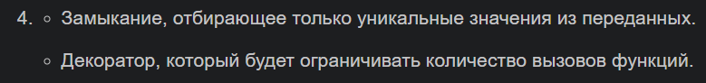
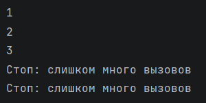

# Отчет 

### Задание
1. Решите обе задачи своего варианта.

2. Примените декоратор к замыканию.
3. Оформите отчёт в README.md.

### Описание проделанной работы
Я реализовала декоратор `limit_calls(max_calls)`, внутри него создала счётчик `count` 
и использовала ключевое слово `nonlocal`, чтобы изменять его во вложенной функции `wrapper`. 
Затем я написала функцию `unique_values()`, которая создаёт замыкание. Внутри неё определила 
пустой список `seen` и применила декоратор `@limit_calls(5)` к внутренней функции `inner`. 
Потом присвоила результат вызова `unique_values()` переменной f. Для тестирования я создала
список данных `data = [1, 2, 2, 3, 1, 4, 5]`. В цикле `for` я последовательно передала 
каждый элемент этого списка в функцию `f` и вывела на консоль.

### Скриншот результата

### Ссылки на использованные материалы
https://evil-teacher.orbiter.website/prog_pm/lab05/