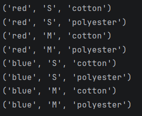

# Отчет 
### Задание
1. Решить задачу своего варианта:
Генератор, создающий все возможные уникальные комбинации элементов из нескольких последовательностей.
2. Оформите отчёт в README.md.

### Описание проделанной работы
Я импортировала функцию `product` из модуля `itertools`.
Затем определила функцию `unique_combinations`, которая принимает 
произвольное количество аргументов `*sequences`. Внутри функции я с помощью 
цикла `for` организовала перебор всех комбинаций, которые возвращает `product(*sequences)`.
Для каждой полученной комбинации использовала ключевое слово `yield`, чтобы функция 
работала как генератор и не хранила все комбинации в памяти одновременно.
Я создала три списка, а потом передала их в вызванную функцию `unique_combinations`.
C помощью цикла `for` вывела каждую полученную комбинацию на консоль.

### Скриншот результата

### Ссылки на использованные материалы
https://evil-teacher.orbiter.website/prog_pm/lab06/