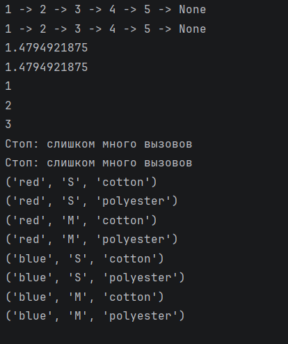

# Отчет 
### Задание
1. Создать пакет, содержащий 3 модуля на основе лабораторных работ №№ 4-6
2. Написать запускающий модуль на основе Typer, который позволит выбирать и настраивать параметры запуска логики из пакета.
3. Оформить отчёт в README.md. 

### Описание проделанной работы
Я создала пакет `lab_package`, в который поместила три модуля:` lab4.py`, `lab5.py` и `lab6.py`. 
Для инициализации пакета я добавила файл `__init__.py`, в котором импортировала все три модуля.
Рядом с пакетом я разместила запускающий модуль `main.py`. 
Я создала в `main.py` CLI-приложение с помощью библиотеки Typer. Для `lab4` я реализовала команды
`lab4-run` для запуска всех функций,`lab4-to-str-iterative` для преобразования списка в строку и
`lab4-sequence-iterative` для вычисления последовательности. Для `lab5` я добавила команду 
`lab5-run` с параметрами `--max-calls` для ограничения вызовов и `--values` для ввода списка 
значений, а также команду `lab5-run-original` для запуска исходного кода. 
Для `lab6` я реализовала команду `lab6-run` с параметрами `--colors`, `--sizes`, `--materials`
для настройки последовательностей и команду `lab6-run-original` для запуска исходного кода.
Для удобства я добавила команду `run-all`, которая последовательно запускает все лабораторные 
работы.

### Скриншот результата

### Ссылки на использованные материалы
https://evil-teacher.orbiter.website/prog_pm/lab07/
