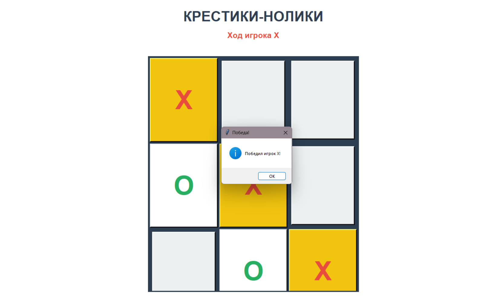

# Отчет 

### Задание
1. Реализовать приложение с GUI по своему варианту. 
Игра “Крестики-нолики”.
2. Оформить README.md. 

### Описание проделанной работы
Я создала класс `TicTacToe`, в котором объединила всю логику игры. В `__init__` я инициализировала
главное окно `tk.Tk()`, задала заголовок «Крестики-нолики» и создала переменные для хранения 
состояния: `current_player = "X"`, `board = [[...]]`, `game_over = False`. Я написала метод 
`create_widgets()`, в котором разместила заголовок, статусную метку для отображения ходов и игровое
поле из 9 кнопок 3×3. Для каждой кнопки я настроила шрифт, размер и цвет. Окно я отцентрировала с 
помощью `center_window()`. В методе `make_move(row, col)` я добавила проверки: если игра окончена
или клетка занята — ход не выполняется. После успешного хода я обновляю поле и отключаю нажатую 
кнопку. Для проверки победы я написала метод `check_win()`, который анализирует строки, столбцы 
и диагонали. При нахождении комбинации я вызываю `highlight_winning_cells()` для подсветки клеток
жёлтым цветом и завершаю игру с сообщением через `messagebox.showinfo()`. Метод `check_draw()` 
проверяет, заполнены ли все клетки — если да, объявляется ничья. После каждого хода я меняю игрока:
`self.current_player = "O" if self.current_player == "X" else "X"`. При победе или ничьей я 
устанавливаю `self.game_over = True`, вывожу всплывающее сообщение и вызываю `disable_all_buttons()`
для блокировки всех кнопок.

### Скриншот результата

### Ссылки на использованные материалы
https://evil-teacher.orbiter.website/prog_pm/lab08/